# Bản đồ dữ liệu AUTO: crawl → chọn bài → draft → video → TikTok

Đối chiếu working tree ngày **30/08/2026**. Đây là mô tả code hiện tại, bao gồm cả các nhánh chưa hoàn thiện; không phải cam kết luồng đã chạy end-to-end thành công. Lượt lập sơ đồ này không sửa code nghiệp vụ, không gọi LLM/TTS/TikTok và không đọc token tài khoản.

Cập nhật phần F/H ngày **31/08/2026**: prompt `auto-draft-compact-2.0`, output `compact-v2` đọc toàn văn, sinh media/text độc lập, không citation IDs hay thời lượng cố định; đã sửa import alignment và mốc 0. Các phần còn lại giữ phạm vi đối chiếu ban đầu, chưa xác nhận end-to-end với dịch vụ thật.

**Cách đọc:** `VÀO` = dữ liệu nhận; `LÀM` = công dụng; `ĐK` = điều kiện; `RA` = dữ liệu/trạng thái tạo ra. Các cụm A–J là các phần phóng to của cùng một flow. Mũi tên liền là đường đi chính; mũi tên đứt là nhánh phụ, thao tác tay hoặc cảnh báo. `!` là điểm cần chú ý trong code hiện tại.

**Con số:** `[C]` cố định trong code; `[MĐ]` mặc định, có thể cấu hình; `[P]` lấy từ profile. Chưa truy vấn profile trong DB hay môi trường deploy, vì vậy không gọi giá trị mặc định là cấu hình đang bật trên tài khoản của bạn.

## 0. Toàn cảnh

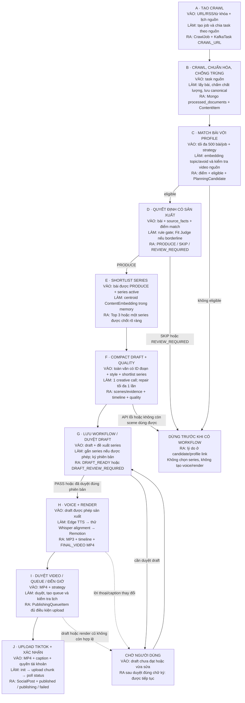

### AUTO là các công tắc độc lập

| Công tắc / cấu hình | Mặc định trong model | Tác dụng thực sự |
|---|---:|---|
| `enable_scheduler` | `true` | Cho phép vòng lịch nguồn và lịch đăng chạy; không tự bật hết các công tắc profile. |
| `source.configuration.schedule_enabled` | Không có thì coi là tắt | Cho nguồn `SOURCE_CONFIG` tạo crawl theo lịch. |
| `receive_system_content` | `true` | Một điều kiện để profile được xét ở bước AUTO. |
| `auto_project_queue_enabled` | `false` | Bật tự xét bài → tạo **MediaWorkflow**, không phải queue đăng bài. |
| `video_render_mode` | `manual` | `auto` mới tự nối draft → voice → render. |
| `approval_mode` | `manual` | `auto` cho phép tự duyệt video sau render; không vượt draft safety gate. |
| `auto_queue_enabled` | `true` | Tự tạo queue ngay sau duyệt video. Có nhánh đồng bộ khi mở trang queue, xem I7. |
| `schedule_enabled` của profile | `true` | Scheduler đăng bài yêu cầu bật. |
| `auto_publish_enabled` | `false` | Scheduler chỉ tự upload khi bật. |
| `min_similarity` / `avoid_similarity_threshold` | `0.62` / `0.72` | Ngưỡng match chủ đề / chủ đề cần tránh. |
| `require_video` | `false` | Yêu cầu **nguồn** có tín hiệu video, không bắt buộc dùng video nguồn trong render. |
| `risk_level` | `medium` | `low` = thận trọng hơn: luôn qua Fit Judge và không tự chấp nhận risk MEDIUM. |
| `schedule_days` / `schedule_times` | `0,1,2,3,4,5,6` / `08:30,20:30` | `0` = thứ Hai; lưu ý timezone tại I4. |
| `schedule_timezone` | `Asia/Bangkok` | Nhánh chọn lịch trên trang queue dùng; nhánh auto sau render hiện chưa dùng. |
| `max_system_recommendations` / `post_frequency_per_day` | `20` / `2` | **Không được áp làm quota** trong consumer AUTO và scheduler đang trace. |

## A. Tạo crawl, lên lịch và chia task

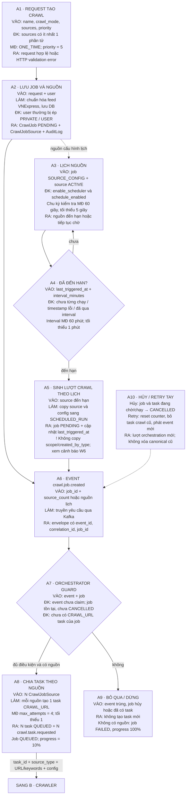

Nguồn: [CrawlJobService](/D:/DATN/socialcontent_backend/services/api-service/app/services/crawl_jobs.py), [scheduler nguồn](/D:/DATN/socialcontent_backend/services/data-ingestion-engine/app/orchestrator/scheduler/periodic_sources.py), [orchestrator](/D:/DATN/socialcontent_backend/services/data-ingestion-engine/app/orchestrator/services/orchestrator.py).

## B. Crawl → chuẩn hóa → canonical → hoàn tất job

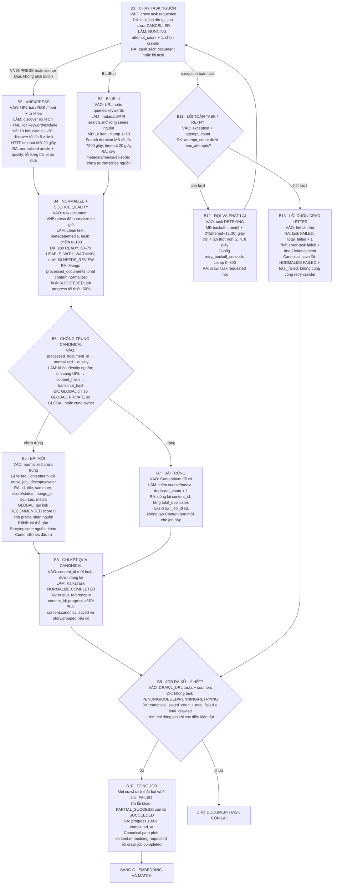

### Điểm chất lượng nguồn — không phải điểm chất lượng kịch bản

| Tín hiệu nguồn | Điểm cộng |
|---|---:|
| Có title | +15 |
| Có content hoặc transcript | +25 |
| Có source_url | +10 |
| Có published_at | +10 |
| Có author | +5 |
| Có media | +10 |
| Content/transcript dài ít nhất 60 ký tự | +15 |
| Có cả source_external_id và language | +10 |

`total_crawled` và `total_normalized` tăng ngay khi crawler lưu processed document; `NORMALIZE COMPLETED` mới là bằng chứng canonical đã ghi xong. Task crawl thành công nhưng không có document vẫn có thể kết thúc job SUCCEEDED với 0 candidate. Nếu crawler đóng job ở nhánh 0 document, nó chỉ phát `crawl.job.completed`, không phát yêu cầu embedding riêng.

Nguồn: [crawler runner](/D:/DATN/socialcontent_backend/services/data-ingestion-engine/app/crawler/services/crawler_runner.py), [quality nguồn](/D:/DATN/socialcontent_backend/services/data-ingestion-engine/app/normalization/validators/quality.py), [canonical writer](/D:/DATN/socialcontent_backend/services/data-ingestion-engine/app/story_processing/services/canonical_writer.py), [điều kiện đóng job](/D:/DATN/socialcontent_backend/common/db/crawl_status.py).

## C. Embedding → match topic/avoid → candidate theo profile

```mermaid
flowchart TD
    C1["C1 · HAI ĐƯỜNG KÍCH HOẠT EMBEDDING<br/>VÀO: content.embedding.requested hoặc matcher ensure qua HTTP<br/>LÀM: kiểm tra embedding thiếu/cũ, không đợi event hoàn tất mới planning<br/>RA: ContentEmbedding dùng chung; không phải LLM quyết định sản xuất"]
    C2["C2 · SOẠN TEXT ĐỂ EMBED<br/>VÀO: ContentItem + full text ở Mongo<br/>LÀM: title + summary + category + tags + 4 câu mở đầu<br/>Giới hạn opening 1800 ký tự; tổng 4000 ký tự<br/>RA: embedding_text"]
    C3["C3 · CACHE / BATCH EMBEDDING<br/>VÀO: embedding_text + model<br/>ĐK: vector đúng model và text chưa đổi → dùng lại<br/>MĐ text-embedding-3-small; 512 chiều<br/>Batch MĐ ≤64 item và ≤240000 ký tự<br/>RA: upsert ContentEmbedding theo content_id + model"]
    C4{"C4 · AUTO CONSUMER ĐƯỢC CHẠY?<br/>VÀO: crawl.job.completed + job_id/status<br/>ĐK: Kafka bật; status SUCCEEDED hoặc PARTIAL_SUCCESS<br/>ĐK profile: active + receive_system_content + auto_project_queue_enabled"}
    C5["C5 · LẤY BÀI CỦA JOB<br/>VÀO: crawl_job_id<br/>ĐK: ContentItem cùng job; READY hoặc USABLE_WITH_WARNING<br/>Sắp updated_at giảm dần rồi quality; giới hạn 500 bài<br/>RA: items dùng để xét cho từng profile<br/>! Đoạn query này chưa lọc scope/owner theo profile"]
    C6["C6 · VECTOR CHỦ ĐỀ VÀ TOPIC SCORE<br/>VÀO: content vector + content_topics/avoid_topics<br/>LÀM: Topic + Description → TopicEmbedding, có cache<br/>Từng topic tính cosine; score = clamp(max cosine ×100)<br/>RA: topic_matches, avoid_matches, similarity S"]
    C7{"C7 · ĐỦ ĐIỀU KIỆN CANDIDATE?<br/>VÀO: S + status + strategy + metadata nguồn<br/>ĐK: ít nhất 1 content topic cosine ≥ T; MĐ T=0.62<br/>Không khớp avoid bằng keyword hoặc cosine ≥ A; MĐ A=0.72<br/>Nếu require_video: content_type VIDEO hoặc duration hoặc video media"}
    C8["C8 · KHÔNG ĐỦ ĐIỀU KIỆN<br/>VÀO: thiếu vector/topics, dưới T, avoid match hoặc thiếu video<br/>RA: eligible=false, lý do; LOW_MATCH hoặc AVOID_TOPIC_MATCH<br/>Keyword khớp topic không thay thế được cosine gate<br/>Không gọi creative LLM cho candidate này"]
    C9["C9 · LƯU XẾP HẠNG<br/>VÀO: mọi điểm candidate của profile<br/>Sort: eligible → similarity → score → quality → thời gian<br/>RA: ProfileContentLink + PlanningRun + PlanningCandidate<br/>Xét tất cả eligible, không cắt ở max_system_recommendations=20"]
    C10{"C10 · WORKFLOW AUTO ĐÃ CÓ?<br/>VÀO: profile_id + content_id + crawl_job_id<br/>Tìm trong 20 workflow gần nhất của profile/content<br/>ĐK: selection_mode AUTO và cùng crawl_job_id"}
    C11["C11 · DÙNG LẠI WORKFLOW<br/>VÀO: workflow đã tồn tại<br/>RA: candidate.selected=true, workflow_id, cập nhật link<br/>Không sinh lại draft và không enqueue lại ở nhánh này"]
    C1 --> C2 --> C3
    C4 -->|đúng| C5 --> C1
    C4 -->|sai| CS["DỪNG AUTO / GHI NHẬN 0 CANDIDATE NẾU KHÔNG CÓ BÀI"]
    C3 --> C6 --> C7
    C7 -->|không| C8 --> C9
    C7 -->|có| C9
    C9 -->|mỗi eligible| C10
    C10 -->|có| C11
    C10 -->|chưa| D0["SANG D · QUYẾT ĐỊNH SẢN XUẤT"]
```

Embedding service lỗi không có fallback “keyword đủ thì sản xuất”: nếu vector không có, cosine gate không qua. Bài trùng dùng content cũ ở B7 thường không nằm trong query `crawl_job_id` mới ở C5. Một bài có thể được xét cho nhiều profile; đây không phải chọn duy nhất một profile cho bài.

Nguồn: [AUTO consumer](/D:/DATN/socialcontent_backend/services/ai-media-engine/app/planning/consumers/crawl_job_completed.py), [matcher](/D:/DATN/socialcontent_backend/common/planning/embedding_matcher.py), [embedding service](/D:/DATN/socialcontent_backend/services/embedding-service/app/service.py).

## D. Quyết định CÓ SẢN XUẤT — chạy trước chọn series

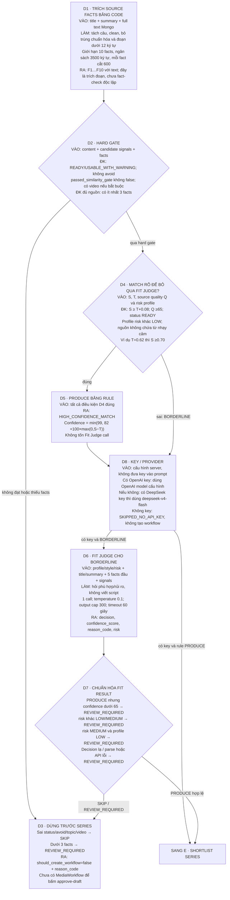

Nguồn nhạy cảm được nhận diện bằng substring trong title, summary và facts: sức khỏe, y tế, thuốc, điều trị, pháp luật, luật, đầu tư, chứng khoán, tiền điện tử, tự tử, bạo lực, tình dục, trẻ em và một số từ tiếng Anh tương ứng. Đây là heuristic, không phải bộ phân loại đầy đủ.

Lưu ý: `Q ≥65` là hằng số của D4, nhưng D4 còn yêu cầu `READY`; với nguồn được chấm theo B4 thì READY thường đã có Q ≥80. `USABLE_WITH_WARNING` và profile risk LOW đều phải qua Fit Judge dù cosine cao.

Nguồn: [production gate và Fit Judge](/D:/DATN/socialcontent_backend/services/ai-media-engine/app/planning/services/auto_workflow_planner.py:411), [source facts](/D:/DATN/socialcontent_backend/services/ai-media-engine/app/planning/services/auto_draft_compact.py:100).

## E. Chọn Top 3 series, không thêm bảng vector series

```mermaid
flowchart TD
    E1["E1 · LẤY SERIES CÒN CHỖ<br/>VÀO: profile_id của bài được PRODUCE<br/>ĐK: ContentSeries cùng profile và ACTIVE<br/>Số part thực = count workflow không REJECTED; FAILED vẫn chiếm chỗ<br/>total_parts=0: không giới hạn; còn lại count phải nhỏ hơn total_parts<br/>RA: tất cả series đủ điều kiện; không cắt 20 series"]
    E2["E2 · LẤY BÀI ĐẠI DIỆN<br/>VÀO: series_ids + candidate ContentEmbedding<br/>LÀM: mỗi series lấy tối đa 5 workflow gần nhất theo updated_at<br/>Loại FAILED/REJECTED; cần primary_content_id<br/>Lấy embedding cùng model, đúng số chiều; khử trùng content_id<br/>RA: 0–5 vector dùng được + 2 recent_items gửi prompt"]
    E3{"E3 · CÓ VECTOR ĐẠI DIỆN?<br/>VÀO: candidate vector và vector bài trong series<br/>ĐK: ít nhất 1 vector tương thích"}
    E4["E4 · CENTROID TRONG MEMORY<br/>VÀO: N vector, 1 ≤ N ≤5<br/>LÀM: vector đại diện = tổng vector / N; cosine với bài mới<br/>Điểm = 0.85×cosine + 0.15×lexical<br/>RA: semantic_score + final_score; không ghi vector series xuống DB"]
    E5["E5 · FALLBACK KHÔNG VECTOR<br/>VÀO: title/summary/topics bài và title/description/theme/angles series<br/>LÀM: lexical Jaccard của token chuẩn hóa<br/>Điểm = min(0.54, 0.7×lexical)<br/>RA: series vẫn có thể vào shortlist, nhưng không tự chốt"]
    E6["E6 · TOP 3<br/>VÀO: điểm mọi series đủ điều kiện<br/>LÀM: sort score giảm dần, rồi recent_vector_count<br/>RA: tối đa 3 series; mỗi series có id/context/count/2 bài gần nhất"]
    E7{"E7 · CHỐT MATCH RÕ RÀNG?<br/>VÀO: Top 1 và Top 2; không Top 2 thì điểm thứ hai=0<br/>ĐK: score1 ≥0.75<br/>ĐK: score1−score2 ≥0.08 và có ít nhất 3 vector khác content_id"}
    E8["E8 · FIXED SERIES<br/>VÀO: E7 đạt<br/>RA: fixed_series_decision USE_EXISTING + exact id + context<br/>Creative call phải giữ id; không cần gửi cả Top 3"]
    E9["E9 · ĐỂ COMPACT CALL CHỌN<br/>VÀO: E7 không đạt hoặc chưa có series<br/>RA: Top 3, có thể rỗng<br/>LLM chọn USE_EXISTING / CREATE_NEW / NONE trong bước F"]
    E1 --> E2 --> E3
    E3 -->|có| E4 --> E6
    E3 -->|không| E5 --> E6
    E6 --> E7
    E7 -->|đạt| E8 --> F0["SANG F · COMPACT CALL"]
    E7 -->|không| E9 --> F0
```

Với series mới có 1–2 vector, code vẫn tính centroid để xếp hạng, nhưng không được tự chốt E8. Nếu 5 workflow gần nhất có bài trùng, N có thể dưới 5; code không tìm tiếp xa hơn để bù đủ 5 bài khác nhau. `Story` được gom từ Bilibili ở B6 là series **nguồn**; `ContentSeries` ở đây là chuỗi nội dung **sản xuất cho profile**, không phải một bảng.

Nguồn: [rank/centroid/fixed match](/D:/DATN/socialcontent_backend/services/ai-media-engine/app/planning/services/auto_workflow_planner.py:674), [count và lock series](/D:/DATN/socialcontent_backend/common/db/content_series.py).

## F. Compact call → quality gate → một lần repair → timeline

```mermaid
flowchart TD
    F1["F1 · COMPACT CALL<br/>VÀO: toàn văn, style/risk, catalog index/type media, fixed hoặc Top 3 series<br/>Thiếu body: EXCERPT_ONLY; không coi description là toàn văn<br/>LÀM: chọn format/angle, text và media độc lập; không citation/timing<br/>1 call; temperature 0.55; output cap 3200; timeout 60 giây<br/>RA: plan + timeline.video/text có ID/liên kết + risk + series_decision"]
    F2["F2 · NORMALIZE OUTPUT<br/>VÀO: JSON LLM; JSON sai được coi như draft rỗng để xét repair<br/>V2 không cắt ở 18 text/700 ký tự; giữ đồ thị ID để kiểm tra<br/>V1 cũ vẫn có đường đọc tương thích<br/>RA: compact draft chuẩn hóa, version v1 hoặc v2"]
    F3["F3 · QUALITY BẰNG CODE<br/>VÀO: compact + toàn nguồn + profile risk + catalog media<br/>LÀM: bắt đầu 100 điểm rồi trừ lỗi<br/>Kiểm tra ID, links, thứ tự phát, source type, title/format/confidence/risk<br/>Kiểm tra số, entity, lặp câu, filler; đếm mỗi text một lần<br/>RA: score + issues + text indexes + PASS hoặc REPAIR"]
    F4{"F4 · PASS?<br/>VÀO: quality result<br/>ĐK: score ≥85 VÀ không có lỗi CRITICAL"}
    F5{"F5 · CÓ LỖI CÓ THỂ REPAIR?<br/>VÀO: issues khi chưa PASS<br/>Chỉ HIGH_RISK_FLAG / RISK_EXCEEDS_PROFILE_TOLERANCE / LOW_MODEL_CONFIDENCE<br/>→ đi thẳng review, không tiêu creative call nữa<br/>Có lỗi khác → được repair tối đa 1 lần"}
    F6["F6 · REPAIR CALL MỘT LẦN<br/>VÀO: current_draft cả ID/links + issues + nguyên source_document + series/media<br/>Cùng contract v2; giữ ID/liên kết hợp lệ, không gửi bản sao scenes<br/>Temperature 0.3; output cap 3200; timeout 60 giây<br/>RA: repaired compact hoặc retry_error"]
    F7["F7 · CHỌN BẢN SAU REPAIR<br/>VÀO: bản đầu và bản sửa, quality của cả hai<br/>Giữ cờ HIGH/CRITICAL; profile LOW giữ cả MEDIUM<br/>ĐK: nhận bản sửa nếu PASS hoặc score sửa ≥ score đầu<br/>RA: một draft; không có lần repair thứ hai"]
    F8{"F8 · CÒN SCENE DÙNG ĐƯỢC?<br/>VÀO: draft cuối<br/>ĐK: scenes không rỗng"}
    F9["F9 · VALIDATE SERIES DECISION<br/>VÀO: fixed/raw decision + Top 3 + title bài<br/>Fixed có thì giữ; USE_EXISTING phải có exact id trong Top 3<br/>CREATE_NEW: title không rỗng, khác title bài, đủ 3 follow-up angles<br/>Sai điều kiện → NONE; total_parts ≥0, 0=ongoing<br/>RA: decision đã kiểm tra; chưa chắc đã ghi series"]
    F10["F10 · DỰNG TIMELINE BẰNG CODE<br/>VÀO: media/text + ID/links + catalog ảnh/video nguồn<br/>V2: text ước lượng word_count/2.5 giây, tối thiểu 1 giây và đủ frame<br/>Chia mỗi text cho media liên kết, gộp phần liền nhau của cùng media<br/>1080×1920, 30 fps; không target 25/40/60; lưu text_weights<br/>RA: timeline có timing + story_data/compact_scenes dẫn xuất"]
    F11["F11 · REVIEW HOẶC READY<br/>VÀO: quality cuối + timeline<br/>PASS → AI_APPROVED; không PASS → DRAFT_REVIEW_REQUIRED<br/>RA: should_create_workflow=true, token_usage, retry_count<br/>Có draft không đồng nghĩa được chạy voice/render"]
    FX["F! · KHÔNG TẠO WORKFLOW<br/>VÀO: call đầu lỗi/API exception hoặc sau repair không có scene<br/>RA: AI_ERROR + error_message ở candidate/profile link<br/>Không tự fallback sang script bịa hoặc retry vô hạn"]
    F1 --> F2 --> F3 --> F4
    F1 -->|call đầu lỗi| FX
    F4 -->|PASS| F8
    F4 -->|chưa PASS| F5
    F5 -->|chỉ lỗi cần người duyệt| F8
    F5 -->|có lỗi repair được| F6 --> F7 --> F8
    F6 -->|retry lỗi: giữ bản đầu| F8
    F8 -->|không| FX
    F8 -->|có| F9 --> F10 --> F11 --> G0["SANG G · LƯU WORKFLOW / DUYỆT"]
    F10 -->|ID/liên kết/media vẫn lỗi sau retry| FX
```

### Quality v2 và tương thích v1

V2 giữ ngưỡng PASS ≥85, không CRITICAL, confidence/risk, title/format, số/entity, lặp lời và filler như bảng dưới. **Không áp dụng** các hàng duration/role/scene count/word count/evidence ID cho v2. Bổ sung lỗi cấu trúc ID/track/media/link: mỗi lỗi CRITICAL trừ 20, tổng nhóm tối đa 50; đồ thị vẫn lỗi sau retry thì không tạo workflow. Tên/số của v2 đối chiếu toàn nguồn, không đối chiếu đoạn được cite. Chi tiết: [contract v2](auto-compact-draft-flow.md).

Bảng lịch sử dưới đây áp dụng đầy đủ chỉ cho **compact-v1**:

| Kiểm tra | Điều kiện / mức trừ | Có tự chặn dù tổng điểm cao? |
|---|---|---|
| Confidence draft | Dưới 60: −20 | Có, CRITICAL |
| Risk HIGH/CRITICAL | −30 | Có |
| Risk MEDIUM khi profile LOW | −20, nếu không có HIGH | Có |
| Thiếu title / format không trong catalog | Mỗi loại −25 | Có |
| Duration không là 25/40/60 | −20 | Có |
| Không scene | −50 | Có; cuối cùng không tạo workflow |
| Role không thuộc format đã chọn | −20 | Có; không bắt buộc thứ tự role cố định |
| Scene quá ít / quá nhiều | −12 / −8 | Không, chỉ trừ điểm |
| Lời thoại quá ngắn / quá dài | −15 / −12 | Không, chỉ trừ điểm |
| Lặp lời thoại giữa scene | Lexical Jaccard ≥0.72; trừ min(30,12+5×số cặp lặp) | Không, chỉ trừ điểm |
| Evidence ID không có trong facts | −25 | Có |
| Scene factual thiếu evidence | Trừ min(30,15+5×số scene thiếu) | Có |
| Entity không có trong facts được cite | Trừ min(35,20+5×số scene lỗi) | Có |
| Số liệu không có trong facts được cite | −25 | Có |
| Filler thuộc danh sách prefix | Trừ min(18,6×số scene lỗi) | Không, chỉ trừ điểm |

| Target | Biên scene trong prompt | Biên scene dùng chấm điểm | Biên từ dùng chung |
|---:|---:|---:|---:|
| 25 giây | 4–8 | 4–8 | 38–80 |
| 40 giây | 6–11 | 6–11 | 60–128 |
| 60 giây | 8–15 | 8–15 | 90–192 |

Biên từ = `round(duration×1.5)` đến `round(duration×3.2)`. “Từ” là cách đếm token từ/ngăn cách trong code, không phải token LLM. Vì PASS là **≥85 và không CRITICAL**, chỉ lỗi “quá ngắn” (−15) vẫn có thể PASS 85. Không diễn giải các biên mềm trên là luật chặn tuyệt đối.

Catalog 8 format: NEWS_BRIEF, EXPLAINER, LISTICLE, MYTH_VS_FACT, STORY_ARC, QA, CONTRARIAN, CASE_STUDY. Role HOOK/QUESTION/CTA/TAKEAWAY/CONCLUSION/SUMMARY được miễn kiểm tra bắt buộc có evidence ID; kiểm tra entity và số vẫn chạy trên mọi scene. Nếu scene không cite ID thì đối chiếu entity/số với toàn bộ facts. Các kiểm tra này không xác minh được mọi diễn giải sai ngữ nghĩa.

Media cho F10 v2: dùng `source_media_index` trỏ đúng loại image/video trong catalog; index sai phải repair. Video thiếu nguồn thật không được đổi ngầm thành ảnh. Image không chọn index thì xoay vòng ảnh nguồn hoặc ảnh demo trong `DEFAULT_IMAGES`. `visual_query` được lưu làm hướng dẫn, **không thêm bước tự tìm/generate ảnh**. Một media có thể giữ qua nhiều text; một text đi qua nhiều media vẫn chỉ đọc một lần.

**Chi phí call của D–F:** 1 compact; có thể +1 Fit Judge và +1 repair. Output cap cộng tối đa `300+3200+3200=6700`, là trần cấu hình của ba call, không phải số token thực tế. Không tính embedding, TTS, Whisper và thao tác AI sửa/regenerate do người dùng bấm. API lỗi retry có thể chỉ nằm ở `retry_error`, nên `retry_count` đếm response creative nhận được không nhất thiết bằng số HTTP attempt đã thử.

Nguồn: [compact và quality](/D:/DATN/socialcontent_backend/services/ai-media-engine/app/planning/services/auto_draft_compact.py), [orchestration compact/repair](/D:/DATN/socialcontent_backend/services/ai-media-engine/app/planning/services/auto_workflow_planner.py:150).

## G. Ghi workflow, áp series và duyệt đúng phiên bản draft

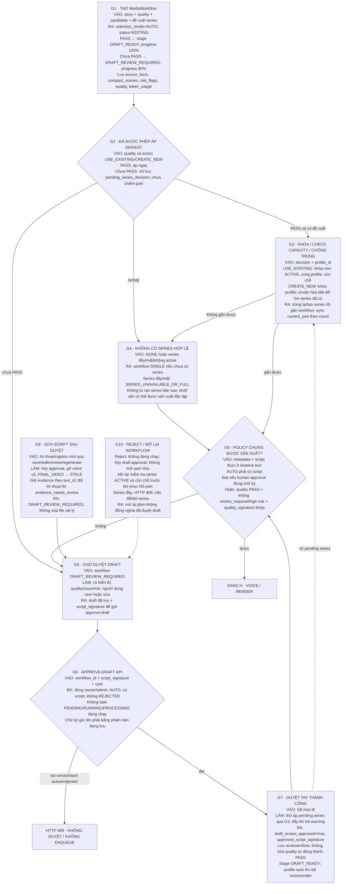

Chữ ký ưu tiên nội dung thực ở `timeline.text`, không tin bản `compact_scenes` cũ. Timing/style/audio và voice tags không làm đổi chữ ký; nội dung lời thoại/caption có đổi thì phải duyệt lại. AI review không thay thế thao tác người dùng duyệt draft. AUTO cũ thiếu `quality_script_signature` cũng không tự chạy qua policy.

Nguồn: [tạo workflow AUTO](/D:/DATN/socialcontent_backend/services/ai-media-engine/app/planning/consumers/crawl_job_completed.py:315), [policy chung](/D:/DATN/socialcontent_backend/common/planning/auto_draft_policy.py), [approve-draft](/D:/DATN/socialcontent_backend/services/api-service/app/api/routes/generate_video.py:556), [reject/mở lại](/D:/DATN/socialcontent_backend/services/api-service/app/api/routes/media_workflows.py:382).

## H. Voice → thử căn thời gian → render MP4

```mermaid
flowchart TD
    H1{"H1 · TỰ TẠO VIDEO ĐƯỢC BẬT?<br/>VÀO: workflow + strategy + policy G8<br/>ĐK auto enqueue: video_render_mode=auto và policy cho phép<br/>Có voice rồi → render; chưa voice → TTS<br/>Task cùng loại đang PENDING/RUNNING/PROCESSING → không tạo trùng"}
    H2["H2 · ENQUEUE VOICE<br/>VÀO: workflow chưa voice<br/>RA: KafkaTask GENERATE_VIDEO_VOICE PENDING<br/>Event generate-video.voice.requested với task_id/workflow_id<br/>AUTO chọn Edge NamMinh; speed MĐ 1.2<br/>Stage QUEUED_VOICE, progress 0%"]
    H3["H3 · TTS WORKER<br/>VÀO: task PENDING/FAILED + draft hiện tại<br/>LÀM: kiểm tra policy lần nữa; đọc timeline.text<br/>AUTO: vi-VN-NamMinhNeural; rate +20%, pitch −2Hz<br/>Speed clamp 0.7–1.2; Edge thử tối đa 3 lần, nghỉ 2 giây<br/>RA: MP3 + audio.voice + timeline.audio voice-main"]
    H4["H4 · WHISPER ALIGNMENT<br/>VÀO: MP3 + script text + OpenAI key<br/>LÀM: whisper-1 → segment/word timestamps rồi khớp scene<br/>HTTP timeout 180 giây; không có key → lỗi alignment<br/>Nếu nhiều scene mà khớp ≤1 hoặc transcript_score dưới 0.35 → lỗi<br/>RA kỳ vọng: timings theo voice; ! code hiện có lỗi thiếu 3 helper"]
    H5["H5 · LƯU VOICE / KIỂM TRA LẠI<br/>VÀO: story sau TTS và alignment<br/>Alignment exception: lưu fit_frame_error, vẫn tiếp tục<br/>RA: task COMPLETED; policy đạt → VOICE_READY, 100%<br/>Script thay đổi → DRAFT_REVIEW_REQUIRED, 80%<br/>V2 căn thời lượng theo voice, không ép target cố định"]
    H6["H6 · ENQUEUE RENDER<br/>VÀO: draft/voice được phép + video_render_mode auto<br/>RA: task GENERATE_VIDEO_RENDER PENDING<br/>Event generate-video.render.requested<br/>Workflow RENDERING / QUEUED_RENDER, progress 0%"]
    H7{"H7 · RENDER WORKER GUARD<br/>VÀO: task PENDING/FAILED + workflow<br/>ĐK: policy còn hợp lệ<br/>Còn script/edit/review/voice task active?<br/>Có → QUEUED_RENDER_AFTER_DRAFT/VOICE, chưa render"}
    H8["H8 · REMOTION RENDER<br/>VÀO: story timeline + ảnh/video/audio + subtitles<br/>LÀM: normalize → Node render-story.mjs → Remotion<br/>1080×1920, 30 fps từ draft; codec h264<br/>MĐ concurrency 4, CRF 23, preset ultrafast<br/>Timeout render MĐ 1800 giây; thiếu dependency có npm install timeout 300 giây<br/>RA: out/final-workflow-renderKey.mp4"]
    H9["H9 · LƯU FINAL VIDEO<br/>VÀO: artifact_path + story sau render<br/>RA: artifacts_jsonb FINAL_VIDEO READY, URI + task_id<br/>draft.video_artifacts.final; task COMPLETED, stage RENDERED, 100%<br/>Chuyển sang policy duyệt video ở I"]
    H10["H10 · FAILED / BLOCKED<br/>Policy sai: task CANCELLED; draft về review<br/>TTS hết 3 lần hoặc render exception: task/workflow FAILED<br/>RA: error_message; chưa tự có vòng retry vô hạn<br/>Task chạy quá 10 phút có thể được DB sweep đưa về PENDING"]
    HM["NHÁNH TAY<br/>VÀO: video_render_mode=manual<br/>RA: dừng ở workspace để người dùng bấm voice/render<br/>API vẫn áp policy AUTO; không bỏ qua review"]
    H1 -->|auto, chưa voice| H2 --> H3 --> H4 --> H5
    H1 -->|auto, đã voice| H6
    H1 -->|manual| HM
    H3 -->|TTS lỗi hết lượt| H10
    H4 -->|alignment lỗi: tiếp tục kèm fit_frame_error| H5
    H5 -->|policy đạt và auto| H6 --> H7
    H5 -->|policy không đạt| G0["QUAY G · DUYỆT DRAFT"]
    H7 -->|không task chặn, policy đạt| H8 --> H9 --> I0["SANG I · DUYỆT VIDEO / QUEUE"]
    H7 -->|policy không đạt| H10
    H8 -->|exception| H10
```

Progress voice: `PREPARING_VOICE 10% → GENERATING_VOICE 30% → ALIGNING_VOICE 76% → SAVING_VOICE 95% → 100%`. Progress render: `PREPARING_RENDER 10% → RENDERING_VIDEO 30% → SAVING_VIDEO 95% → 100%`. Đây là mốc đặt trong code, không phải phần trăm thời gian thực hay mức chất lượng.

AUTO dùng Edge TTS nên không chạy DeepSeek emotion tagging. Nếu người dùng đổi sang ElevenLabs thì có nhánh tag giọng bằng DeepSeek trước TTS; đó là call bổ sung ngoài compact flow. Nếu có nhạc, bước voice đặt musicVolume=0.08; draft tự tạo ban đầu musicVolume=0 và không tự chọn nhạc.

**Cập nhật H4 ngày 31/08:** đã bổ sung ba import `prevent_timeline_text_overlap`, `fit_video_clips_to_text`, `normalize_audio_clips`; sửa mốc 0 không cộng một frame và căn theo `voice_text` nếu khác subtitle. Test mock transcript đã đi qua đường này và giữ liên kết media/text. Chưa gọi Whisper thật; lỗi API/audio vẫn có thể tạo `fit_frame_error` như trước.

Nguồn: [voice/render jobs](/D:/DATN/socialcontent_backend/services/ai-media-engine/app/video/services/generate_video_jobs.py:726), [TTS](/D:/DATN/socialcontent_backend/services/ai-media-engine/app/video/services/generate_video_voice.py:38), [alignment](/D:/DATN/socialcontent_backend/services/ai-media-engine/app/video/services/generate_video_alignment.py:25), [renderer](/D:/DATN/socialcontent_backend/services/ai-media-engine/app/video/services/generate_video_rendering.py:54), [Remotion settings](/D:/DATN/socialcontent_backend/data_demo/video_gen_demo/scripts/render-story.mjs).

## I. Duyệt video → tạo queue → scheduler đến giờ

```mermaid
flowchart TD
    I1{"I1 · MODULE 4 SAU RENDER<br/>VÀO: MP4 + story + strategy<br/>ĐK: draft policy vẫn đạt<br/>approval_mode=auto?"}
    I2["I2 · TỰ DUYỆT VIDEO<br/>VÀO: policy đạt và approval_mode auto<br/>LÀM: set video_approved=true, module4_review approved<br/>RA: video được duyệt; chưa đồng nghĩa đã upload<br/>Basic check là metadata render hoàn tất, không AI review MP4 riêng"]
    I3["I3 · CHỜ DUYỆT VIDEO TAY<br/>VÀO: approval_mode manual<br/>RA: RENDERED / WAITING_HUMAN_REVIEW<br/>Người dùng approve-video: phải có MP4 hiện hành, policy đạt, không active task<br/>Approve → video_approved=true; yêu cầu sửa → EDITING"]
    I4["I4 · CHỌN LỊCH AUTO SAU RENDER<br/>VÀO: schedule_days/times và thời gian UTC hiện tại<br/>LÀM: tìm slot đầu tiên trong hôm nay + 7 ngày tới<br/>Không lịch hoặc schedule tắt → fallback +1 giờ<br/>! Hàm này chưa đọc schedule_timezone<br/>RA: scheduled_at; không phân bổ quota/giãn slot giữa nhiều video"]
    I5{"I5 · TỰ ĐƯA VÀO QUEUE?<br/>VÀO: video approved + auto_queue_enabled<br/>true → tạo/cập nhật queue<br/>false → dừng VIDEO_APPROVED / AUTO_APPROVED"}
    I6["I6 · PUBLISHING QUEUE<br/>VÀO: workflow, MP4 URI, title/caption, profile, scheduled_at<br/>LÀM: tạo hoặc dùng queued_post_id đang có<br/>RA: PublishingQueueItem status=approved<br/>Workflow QUEUED_FOR_PUBLISHING; caption MĐ là title<br/>article_link ở đây là đường dẫn MP4, không phải URL bài nguồn"]
    I7["I7 · NHÁNH KHI MỞ TRANG QUEUE<br/>VÀO: list_user_queue → scan workflow RENDERED/VIDEO_APPROVED/QUEUED_FOR_PUBLISHING<br/>ĐK: policy đạt, có final video, chưa có queue hợp lệ<br/>RA: queue needs_approval, lịch hiện tại +2 giờ<br/>! Không kiểm auto_queue_enabled ở nhánh đồng bộ này"]
    I8["I8 · REVIEWER CHỌN LỊCH / ĐĂNG NGAY<br/>VÀO: queue item + lựa chọn người dùng<br/>Đăng ngay: approved, scheduled_at=now → gọi publish<br/>Chọn lịch AI: rule-based, không LLM; dùng schedule_timezone<br/>Slot phải sau now+5 phút; tìm 0–7 ngày; fallback +1 giờ<br/>Lịch tay phải ở tương lai; RA queue approved"]
    I9["I9 · PUBLISH SCHEDULER TICK<br/>VÀO: enable_scheduler + SystemSetting<br/>Chu kỳ MĐ 5 phút, cấu hình clamp 1–1440 phút<br/>Mỗi tick: poll tối đa 10 bài đang publishing trước<br/>Sau đó chọn tối đa 5 queue item đến giờ trên toàn hệ thống"]
    I10{"I10 · ELIGIBLE ĐỂ TỰ ĐĂNG?<br/>VÀO: queue + profile + strategy<br/>ĐK: platform=tiktok; queued/approved; scheduled_at ≤ now<br/>Profile active và access_token khác NULL<br/>schedule_enabled và auto_publish_enabled=true<br/>Nếu status=queued thì approval_mode phải auto"}
    I11["I11 · KIỂM TRA LẠI TRƯỚC UPLOAD<br/>VÀO: queue + workflow liên kết qua queued_post_id<br/>AUTO: chưa REJECTED; draft policy đạt<br/>Có FINAL_VIDEO hiện hành không STALE; article_link trùng URI này<br/>RA: được upload hoặc HTTP 409; không đăng bản render cũ"]
    IW["CHỜ / KHÔNG CHỌN TRONG TICK<br/>VÀO: chưa đến giờ, thiếu token, tắt auto_publish hoặc sai trạng thái<br/>RA: queue vẫn còn; không tự bị xóa"]
    I1 -->|policy không đạt| G0["QUAY G · REVIEW DRAFT"]
    I1 -->|auto| I2 --> I5
    I1 -->|manual| I3 -->|người dùng duyệt| I5
    I5 -->|true| I4 --> I6
    I5 -->|false| IS["VIDEO_APPROVED · CHƯA TẠO QUEUE Ở NHÁNH NÀY"]
    IS -.->|người dùng mở trang queue| I7
    I3 -.->|mở trang queue| I7 --> I8
    I6 --> I9 --> I10
    I8 -->|lên lịch| I9
    I8 -->|đăng ngay| I11
    I10 -->|đạt| I11 -->|hợp lệ| J0["SANG J · TIKTOK DIRECT POST"]
    I10 -->|không| IW
    I11 -->|draft/video cũ| G0
```

`5 item/tick` không phải 5 bài/profile và cũng không phải quota ngày. Query lấy 5 item trước rồi mới xét một số công tắc strategy: item bị bỏ qua không được tự bù bằng item thứ 6 trong cùng lượt. `max_system_recommendations=20` và `post_frequency_per_day=2` không hạn chế số workflow/video ở đường AUTO này. Nhiều video có thể nhận cùng slot `08:30` hoặc `20:30`.

Nhánh auto schedule hiện dùng `datetime.utcnow()` để ghép `schedule_times`; nhánh “AI chọn lịch” trên queue dùng `ZoneInfo(schedule_timezone)`. Do đó chưa thể hiểu cùng chuỗi `08:30` là cùng giờ địa phương ở cả hai nhánh. Scheduler có thể đợi lâu hơn chu kỳ danh nghĩa vì mỗi lượt xử lý upload tuần tự rồi mới sleep.

Nguồn: [policy sau render và lịch auto](/D:/DATN/socialcontent_backend/services/ai-media-engine/app/video/services/generate_video_jobs.py:1077), [approve-video/queue API](/D:/DATN/socialcontent_backend/services/api-service/app/api/routes/generate_video.py:619), [queue sync và lựa chọn lịch](/D:/DATN/socialcontent_backend/services/api-service/app/services/social_profiles.py:613), [publish scheduler](/D:/DATN/socialcontent_backend/services/api-service/app/services/publish_scheduler.py:132).

## J. Push video lên TikTok và phân biệt upload với publish

Các số dưới đây mô tả **client code trong repo**, không khẳng định giới hạn hiện hành của nền tảng TikTok. Scheduler này chỉ tự đăng TikTok; không có nhánh auto Facebook/YouTube/Instagram tương đương trong đường đang trace.

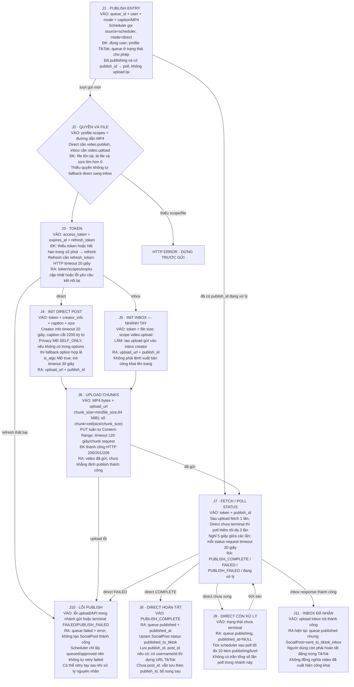

Luồng AUTO không truyền `privacy_level`, nên client chọn mặc định `SELF_ONLY` nếu option này được hỗ trợ. Vì vậy **“Direct Post thành công” không có nghĩa “video công khai cho mọi người”**. Phải xem privacy được chọn và trạng thái TikTok trả về.

`publish_id` là mã tác vụ upload/publish; `post_id` là mã video trên nền tảng. Hai giá trị khác nhau. Hàm complete đang trace cập nhật `PublishingQueueItem` và `SocialPost`, không trực tiếp chuyển `MediaWorkflow.status` sang `PUBLISHED`. Vì thế không chỉ nhìn trạng thái workflow để kết luận video đã đăng.

Các lỗi guard trước khi item được set `publishing` — chẳng hạn draft cũ, thiếu scope hoặc đường dẫn không resolve được — có thể trả HTTP lỗi mà giữ nguyên trạng thái queue. Đây khác lỗi upload/API trong `try`, nơi code ghi `failed`. Bộ đếm `published` của scheduler tăng khi hàm publish trả về; nó không phải bằng chứng từng video đã có `PUBLISH_COMPLETE`.

Nguồn: [publish orchestration](/D:/DATN/socialcontent_backend/services/api-service/app/services/social_profiles.py:1310), [TikTok request/chunk/token/privacy](/D:/DATN/socialcontent_backend/services/api-service/app/services/tiktok_posting.py:146), [complete và poller](/D:/DATN/socialcontent_backend/services/api-service/app/services/social_profiles.py:1103).

## K. Nhánh hạ tầng, retry và sự kiện bị lặp/mất

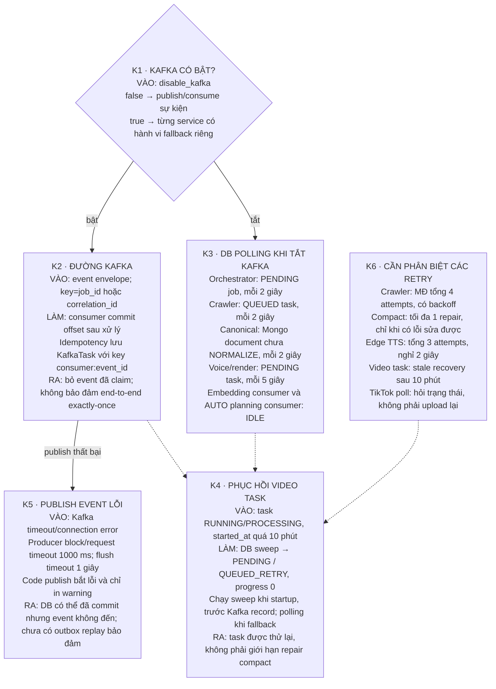

! Fallback crawler DB polling hiện đọc `source_type/source_url/keywords/configuration` từ task payload, trong khi orchestrator đang lưu chủ yếu `job_source_id/external_reference` ở payload đó. Vì vậy không thể coi chế độ tắt Kafka là đường AUTO đầy đủ tương đương Kafka. Hơn nữa AUTO planning consumer sẽ idle khi `disable_kafka=true`.

! Ngưỡng stale task **10 phút** nhỏ hơn timeout render mặc định **30 phút**. Với nhiều worker/sweep, một render còn hợp lệ nhưng lâu có thể bị coi là stale; đây là khác biệt cần kiểm chứng bằng integration test, không phải timeout render chỉ 10 phút.

Nguồn: [Kafka adapter](/D:/DATN/socialcontent_backend/common/events/kafka.py), [event claim](/D:/DATN/socialcontent_backend/common/db/idempotency.py), [video DB sweep](/D:/DATN/socialcontent_backend/services/ai-media-engine/app/video/consumers/generate_video_requested.py:47), [crawler polling](/D:/DATN/socialcontent_backend/services/data-ingestion-engine/app/crawler/consumers/task_requested.py).

## 1. Dữ liệu được lưu ở đâu và ai dùng tiếp?

| Dữ liệu | Nội dung chính | Bên ghi → bên đọc tiếp |
|---|---|---|
| `CrawlJob` + `CrawlJobSource` | Nguồn, scope/owner, mode, lịch, status và counter | API/scheduler → orchestrator/crawler/canonical |
| `KafkaTask` CRAWL_URL | reference job, payload nguồn, attempt/status/error | Orchestrator → crawler |
| Mongo `processed_documents` | normalized text/transcript, media, quality, source metadata | Crawler/normalizer → canonical; full text → embedding/planner |
| `ContentItem` | Canonical id/title/summary/quality/status/hash, sources/media, mongo id, crawl_job_id | Canonical → matcher/planner |
| `Story` + content episode order | Nhóm/episode của nguồn Bilibili | Canonical grouping → giao diện/luồng nguồn; không phải output series |
| `ContentEmbedding` | content_id, model, vector, embedding_text, dimension | Embedding service → matcher và centroid series |
| `TopicEmbedding` | Vector topic+description, model/cache hash | Matcher → so topic/avoid cho nhiều bài |
| `ProfileContentLink` | Candidate score/status/reasons/AI decision theo profile/content | Canonical khởi tạo; AUTO matcher cập nhật → giao diện Content |
| `PlanningRun` / `PlanningCandidate` | Một lần xét theo profile/job; rank, eligible, selected, decisions, workflow_id | AUTO consumer → lịch sử quyết định |
| `ContentSeries` | Title/theme, ACTIVE, total_parts, current_part | Khi PASS/duyệt + chọn series → workflow kế tiếp dùng làm context |
| `MediaWorkflow.draft_json` | `meta`, `source`, `timeline`, `story_data`, `compact_scenes`, `audio`, `video_artifacts` | Planner/API/worker → editor, TTS, renderer |
| `MediaWorkflow.metadata_json` | production gate, draft quality/risk, signatures, pending series, approvals, queued_post_id | Planner/reviewer/worker → policy ở API/worker/publish |
| `KafkaTask` GENERATE_VIDEO_* | workflow reference, task parameters, progress, result/error | API/planner → video worker |
| `PromptRun` | Prompt/result/usage của những bước có logging | LLM/embedding/TTS wrapper → theo dõi chi phí và debug |
| `assets/audio/*.mp3` | Voice vật lý; draft lưu URI tương đối | TTS → Whisper/Remotion |
| `out/final-*.mp4` + `artifacts_jsonb` | File MP4; artifact URI/status/task_id | Renderer → preview/queue/TikTok upload |
| `PublishingQueueItem` | Profile, MP4 URI, caption, schedule, publish_id/status/error | Module 4/reviewer → publish scheduler/service |
| `SocialPost` | publish_id, post_id/URL nếu có, caption, published time/status | TikTok complete/inbox → trang bài đăng và analytics |

File media nằm dưới `socialcontent_backend/data_demo/video_gen_demo/public/assets/audio` và `socialcontent_backend/data_demo/video_gen_demo/out`. Kafka chủ yếu mang **ID để worker tải dữ liệu từ DB/Mongo**, không chở toàn bộ MP3/MP4. Dữ liệu video chỉ được gửi thành bytes ở bước upload TikTok.

## 2. Các trạng thái trông giống nhau nhưng khác ý nghĩa

| Trạng thái | Nghĩa đúng |
|---|---|
| `ContentItem.READY` | Nguồn đủ điểm cấu trúc/dữ liệu; chưa chắc phù hợp profile hoặc đáng sản xuất. |
| Candidate `eligible=true` | Qua topic/avoid/video-source gate; chưa qua production decision. |
| Production `PRODUCE` | Được phép sinh draft; chưa có kết quả quality draft. |
| Production `REVIEW_REQUIRED` | Dừng trước workflow; không có draft để approve-draft. |
| `DRAFT_REVIEW_REQUIRED` | Đã có workflow/draft nhưng chặn voice/render. |
| `DRAFT_READY` | Draft được phép tiếp tục; `video_render_mode=manual` vẫn dừng chờ. |
| `VOICE_READY` | Có voice; alignment có thể có lỗi được lưu, không chắc khớp hoàn hảo. |
| `RENDERED` | Có render result; chưa đồng nghĩa đã duyệt/queue/publish. |
| `VIDEO_APPROVED` | Đã duyệt video; chưa chắc có queue. |
| `QUEUED_FOR_PUBLISHING` | Đã có item hàng đợi, không chắc đã đến giờ hay auto_publish bật. |
| Queue `approved` | Được duyệt trong hàng đợi; vẫn còn guard và điều kiện lịch/token. |
| Queue `publishing` | TikTok chưa xác nhận terminal; cần poll tiếp. |
| Queue `published` + SocialPost `published_to_tiktok` | Direct Post hoàn tất; độ hiển thị còn phụ thuộc privacy. |
| Queue `published` + SocialPost `sent_to_tiktok_inbox` | Đã gửi inbox; người dùng còn phải xuất bản trong TikTok. |

## 3. Những điểm hiện trạng không nên hiểu nhầm

1. **W1 — Alignment đã sửa lỗi thiếu helper trong code ngày 31/08.** Test mock đã qua; chưa khẳng định Whisper thật hay render end-to-end đã thành công.
2. **W2 — Lịch auto sau render chưa dùng timezone profile.** Nhánh queue “AI chọn lịch” lại dùng timezone; hai nhánh chưa thống nhất. Không coi `08:30` là 08:30 giờ Việt Nam ở mọi đường đi.
3. **W3 — Chưa có quota sản xuất/ngày ở consumer AUTO.** Tối đa 500 nguồn/job được xét, mọi eligible có thể tạo workflow cho từng profile; mặc định 20 recommendations và 2 post/ngày không được dùng để chặn ở đây.
4. **W4 — AUTO không tự bảo đảm public.** Scheduler chỉ Direct Post TikTok, privacy mặc định SELF_ONLY. Upload inbox và Direct Post có ý nghĩa khác nhau dù queue có thể cùng ghi published.
5. **W5 — Tắt Kafka làm mất đường kích hoạt AUTO planning.** Crawl/video có fallback riêng nhưng AUTO consumer idle; Kafka publish lỗi hiện chỉ warning, không có bảo đảm outbox/replay xuyên suốt.
6. **W6 — Phạm vi dữ liệu cần rà lại trước production.** Scheduler nguồn không copy `content_scope/created_by_type` sang SCHEDULED_RUN, nên rơi về default GLOBAL/SYSTEM của model. Query AUTO lại chỉ lọc crawl_job_id/status, không lọc PRIVATE owner theo profile. Đây là thiếu kiểm tra trong code đang trace, không phải hành vi phân quyền nên mặc định chấp nhận.
7. **W7 — V2 dùng được ảnh/video nguồn, không tự tìm/generate visual.** Image thiếu nguồn vẫn dùng ảnh demo. `require_video` chỉ là gate nguồn, không ép mọi clip phải là video.
8. **W8 — Tắt auto_queue không ngăn mọi cách tạo queue.** Mở trang queue có nhánh đồng bộ workflow rendered/approved sang needs_approval; xem I7.
9. **W9 — Đừng suy ra đã đăng từ MediaWorkflow hoặc counter scheduler.** Xem trạng thái queue + SocialPost + response TikTok; có publish_id chưa chắc có post_id hay public URL.

Ngoài W1/W7 được cập nhật rõ ở trên, các mục còn lại vẫn là ghi nhận của lượt vẽ ban đầu. Regression tests không thay thế integration test thật cho toàn chuỗi crawl, Whisper, Kafka, lịch và TikTok.

## 4. Ví dụ đường đi để đọc sơ đồ

**Ví dụ minh họa, không phải dữ liệu thực:** nguồn mới READY, Q=90; profile T=0.62, S=0.73, không avoid, risk MEDIUM, ít nhất 3 facts, không từ nhạy cảm → D4 đi thẳng PRODUCE. Series tốt nhất score=0.81, thứ hai=0.68, có 4 vector khác content_id → fixed USE_EXISTING. Compact quality=92, không CRITICAL → lưu draft PASS và ký phiên bản. Nếu `video_render_mode=auto` → Edge TTS rồi thử alignment, render; `approval_mode=auto` → duyệt; `auto_queue_enabled=true` → queue. Đến lịch, còn cần `schedule_enabled=true`, `auto_publish_enabled=true`, token và `video.publish` mới gửi TikTok. Direct Post mặc định SELF_ONLY; chỉ khi TikTok trả PUBLISH_COMPLETE mới hoàn tất Direct Post.

**Ví dụ nhánh review:** cùng bài nhưng S=0.65 → qua cosine 0.62 nhưng chưa đạt 0.70 để bypass Fit Judge. Fit risk HIGH → dừng trước series, không tạo workflow. Nếu Fit PRODUCE nhưng draft có số liệu không có trong facts → một repair; vẫn lỗi → tạo draft chờ duyệt, chưa gắn pending series, không TTS. Người dùng duyệt đúng chữ ký mới tiếp tục; sửa lời thoại sau đó sẽ hủy duyệt và vô hiệu hóa media cũ.
